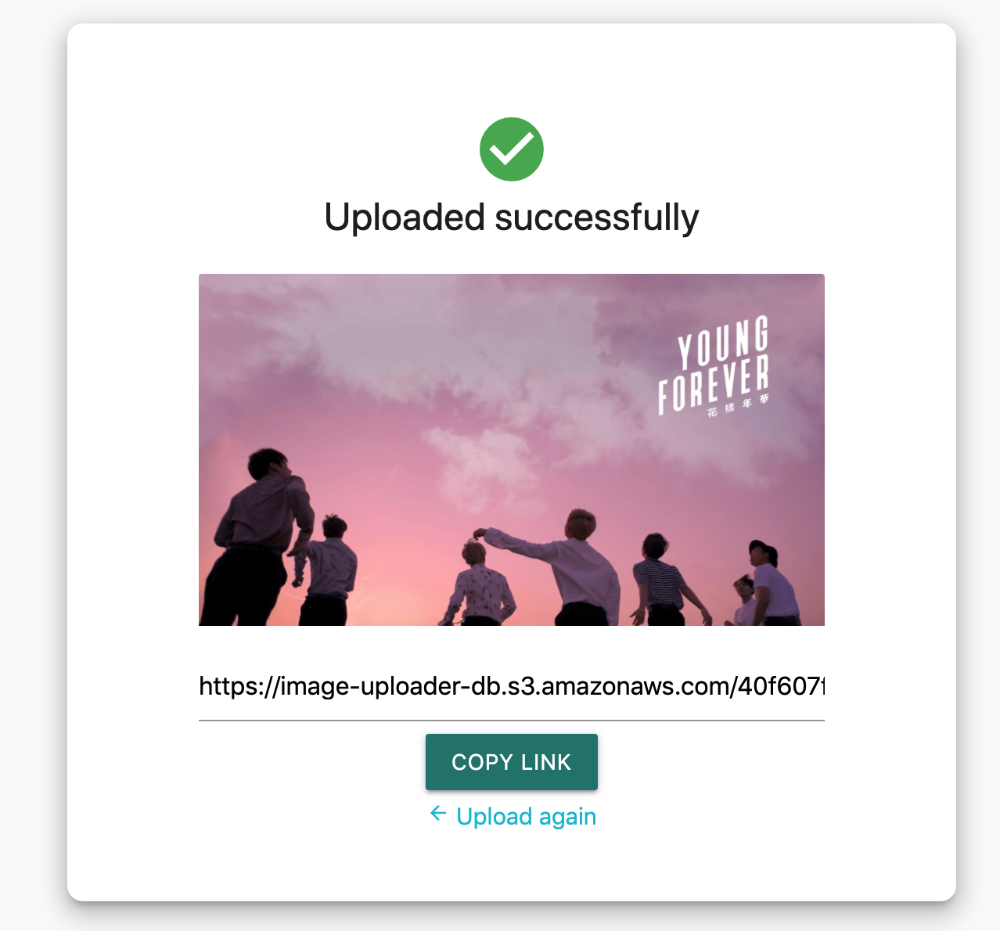

<!-- Please update value in the {}  -->

<h1 align="center">Image Uploader</h1>

   Solution for a challenge from  <a href="http://devchallenges.io" target="_blank">Devchallenges.io</a>.

  <h3>
    <a href="https://image-uploader-1998.herokuapp.com/">
      Demo
    </a>
     | 
    <a href="https://github.com/tommypnguyen/image-uploader">
      Solution
    </a>
     | 
    <a href="https://devchallenges.io/challenges/O2iGT9yBd6xZBrOcVirx">
      Challenge
    </a>
  </h3>

<!-- TABLE OF CONTENTS -->

## Table of Contents

- [Overview](#overview)
  - [Built With](#built-with)
- [Features](#features)
- [How to use](#how-to-use)
- [Contact](#contact)
- [Acknowledgements](#acknowledgements)

<!-- OVERVIEW -->

## Overview

Introduce your projects by taking a screenshot or a gif. Try to tell visitors a story about your project by answering:

- Where can I see your demo?
- What was your experience?
- What have you learned/improved?
- Your wisdom? :)

For this project we were tasked with building an Image Uploader application, with the ability to

- Drag and Drop Images or Upload them through a button
- Allow users to view image and provide a link to the uploaded image

Overall it was a challenging, but enjoyable experience. Before coming accross dev challenges, I would always start projects but never complete them or even get to deploying them. By completing this challenge, not only have I learned how to create and navigate a full-stack application, but also how to deploy one. Whether you are a beginner or experienced developer, this will be great for you to take on.

### Built With

<!-- This section should list any major frameworks that you built your project using. Here are a few examples.-->

- [React](https://reactjs.org/)
- [Materialize CSS](https://materializecss.com/)
- [Flask](https://flask.palletsprojects.com/en/2.0.x/)
- [AWS S3](https://aws.amazon.com/s3/)

## Features

<!-- List the features of your application or follow the template. Don't share the figma file here :) -->

This application/site was created as a submission to a [DevChallenges](https://devchallenges.io/challenges) challenge. The [challenge](https://devchallenges.io/challenges/O2iGT9yBd6xZBrOcVirx) was to build an application to complete the given user stories.

- I can drag and drop an image to upload it
- I can choose to select an image from my folder
- I can see a loader when uploading
- When the image is uploaded, I can see the image and copy it
- I can choose to copy to the clipboard

## Acknowledgements

<!-- This section should list any articles or add-ons/plugins that helps you to complete the project. This is optional but it will help you in the future. For example -->

- [How To Build & Deploy a React + Flask App](https://towardsdatascience.com/build-deploy-a-react-flask-app-47a89a5d17d9)
- [Using AWS S3 to Store Static Assets and File Uploads](https://devcenter.heroku.com/articles/s3)

## Contact

- GitHub [tommypnguyen](https://{github.com/tommypnguyen})
